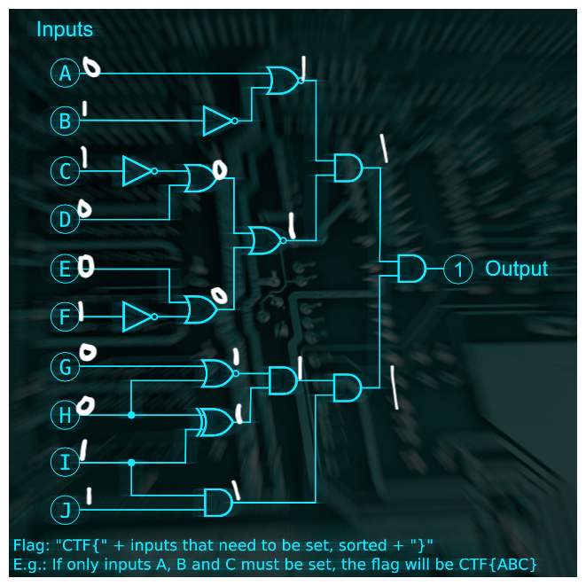

## Novosibirsk - Chemical plant
```html
<html>
<head>
  <meta charset="utf-8">
  <title>CCTV</title>
  <style>
html, body {
  margin: 0;
  padding: 0;
  width: 100vw;
  height: 100vh;
  font-family: monospace;
  font-size: 1.25em;
}

.outer {
  width: 100%;
  height: 100%;
  display: flex;
  flex-direction: column;
}

.top {
  background: rgb(78,78,78);
  background: linear-gradient(0deg, rgba(78,78,78,1) 22%, rgba(34,34,34,1) 93%);
  height: 2em;
}

.top div {
  padding: 0.1em;
  font-size: 1.5em;
  font-weight: bold;
  color: white;
}

.container {
  display: flex;
  flex-direction: row;
  flex: 1;
  background-color: #333333;
  justify-content: center;
  align-content: center;
  align-items: center;
}

.panel {
  flex-direction: column;
  display: flex;
  justify-content: center;
  align-content: center;
  align-items: center;
  width: 25%;
  height: 25%;
  background: rgb(78,78,78);
  background: linear-gradient(0deg, rgba(78,78,78,1) 22%, rgba(34,34,34,1) 93%);
  border: 1px solid black;
  color: white;
}

.bottom {
  background: rgb(78,78,78);
  background: linear-gradient(0deg, rgba(78,78,78,1) 22%, rgba(34,34,34,1) 93%);
  height: 2em;
}

.bottom div {
  padding: 0.4em;
  font-weight: bold;
  color: white;
}

button {
  color: white;
  background: linear-gradient(0deg, rgba(78,78,78,1) 22%, rgba(34,34,34,1) 93%);
}
  </style>
</head>
<body>
  <div class="outer">
    <div class="top"><div>Industrial CCTV by YesWeAreSecure&trade;</div></div>
    <div class="container">
      <div class="panel">
        <p>Password:</p>
        <input id="password">
        <p><button id="go">Log in</button></p>
      </div>
    </div>
    <div class="bottom"><div>Use the panel to log in.</div></div>
  </div>
</body>
<script>
const checkPassword = () => {
  const v = document.getElementById("password").value;
  const p = Array.from(v).map(a => 0xCafe + a.charCodeAt(0));
  alert(p)
  if(p[0] === 52037 &&
     p[6] === 52081 &&
     p[5] === 52063 &&
     p[1] === 52077 &&
     p[9] === 52077 &&
     p[10] === 52080 &&
     p[4] === 52046 &&
     p[3] === 52066 &&
     p[8] === 52085 &&
     p[7] === 52081 &&
     p[2] === 52077 &&
     p[11] === 52066) {
    window.location.replace(v + ".html");
  } else {
    p[0] = 52037
    p[6] = 52081
    p[5] = 52063
    p[1] = 52077
    p[9] = 52077
    p[10] = 52080
    p[4] = 52046
    p[3] = 52066
    p[8] = 52085
    p[7] = 52081
    p[2] = 52077
    p[11] = 52066
    alert(p);
    // decode
    const s = Array.from(p).map(a => String.fromCharCode(a - 0xCafe)).join("");
    alert(s)
  }
}

window.addEventListener("DOMContentLoaded", () => {
  document.getElementById("go").addEventListener("click", checkPassword);
  document.getElementById("password").addEventListener("keydown", e => {
    if (e.keyCode === 13) {
      checkPassword();
    }
  });
}, false);
</script>
</html>

```
## Moscow - Apartment

### Referensi
https://en.wikipedia.org/wiki/Logic_gate

## Secret Location - Base
```python
current = 0
out = ""
#Drive high every GPIO appearing in mask. Drive high every GPIO appearing in mask. 
def gpio_set_mask(b):
    global current
    current |= b

#Drive low every GPIO appearing in mask. 
def gpio_clr_mask(b):
    global current
    current &= (b ^ 0xFF)
    

def sleep_us(a):
    global current
    global out
    #print(chr(current))
    out = out + chr(current)

gpio_set_mask(67)
gpio_clr_mask(0)
sleep_us(100)
gpio_set_mask(20)
gpio_clr_mask(3)
sleep_us(100)
gpio_set_mask(2)
gpio_clr_mask(16)
sleep_us(100)
gpio_set_mask(57)
gpio_clr_mask(4)
sleep_us(100)
gpio_set_mask(0)
gpio_clr_mask(25)
sleep_us(100)
gpio_set_mask(5)
gpio_clr_mask(2)
sleep_us(100)
gpio_set_mask(18)
gpio_clr_mask(65)
sleep_us(100)
gpio_set_mask(1)
gpio_clr_mask(2)
sleep_us(100)
gpio_set_mask(64)
gpio_clr_mask(17)
sleep_us(100)
gpio_set_mask(2)
gpio_clr_mask(0)
sleep_us(100)
gpio_set_mask(1)
gpio_clr_mask(6)
sleep_us(100)
gpio_set_mask(18)
gpio_clr_mask(65)
sleep_us(100)
gpio_set_mask(1)
gpio_clr_mask(0)
sleep_us(100)
gpio_set_mask(4)
gpio_clr_mask(2)
sleep_us(100)
gpio_set_mask(0)
gpio_clr_mask(0)
sleep_us(100)
gpio_set_mask(64)
gpio_clr_mask(16)
sleep_us(100)
gpio_set_mask(16)
gpio_clr_mask(64)
sleep_us(100)
gpio_set_mask(2)
gpio_clr_mask(4)
sleep_us(100)
gpio_set_mask(0)
gpio_clr_mask(3)
sleep_us(100)
gpio_set_mask(9)
gpio_clr_mask(0)
sleep_us(100)
gpio_set_mask(0)
gpio_clr_mask(1)
sleep_us(100)
gpio_set_mask(0)
gpio_clr_mask(8)
sleep_us(100)
gpio_set_mask(8)
gpio_clr_mask(0)
sleep_us(100)
gpio_set_mask(65)
gpio_clr_mask(24)
sleep_us(100)
gpio_set_mask(22)
gpio_clr_mask(64)
sleep_us(100)
gpio_set_mask(0)
gpio_clr_mask(0)
sleep_us(100)
gpio_set_mask(0)
gpio_clr_mask(5)
sleep_us(100)
gpio_set_mask(0)
gpio_clr_mask(2)
sleep_us(100)
gpio_set_mask(65)
gpio_clr_mask(16)
sleep_us(100)
gpio_set_mask(22)
gpio_clr_mask(65)
sleep_us(100)
gpio_set_mask(1)
gpio_clr_mask(6)
sleep_us(100)
gpio_set_mask(4)
gpio_clr_mask(0)
sleep_us(100)
gpio_set_mask(66)
gpio_clr_mask(21)
sleep_us(100)
gpio_set_mask(1)
gpio_clr_mask(0)
sleep_us(100)
gpio_set_mask(0)
gpio_clr_mask(2)
sleep_us(100)
gpio_set_mask(24)
gpio_clr_mask(65)
sleep_us(100)
gpio_set_mask(67)
gpio_clr_mask(24)
sleep_us(100)
gpio_set_mask(24)
gpio_clr_mask(67)
sleep_us(100)
gpio_set_mask(2)
gpio_clr_mask(8)
sleep_us(100)
gpio_set_mask(65)
gpio_clr_mask(18)
sleep_us(100)
gpio_set_mask(16)
gpio_clr_mask(64)
sleep_us(100)
gpio_set_mask(2)
gpio_clr_mask(0)
sleep_us(100)
gpio_set_mask(68)
gpio_clr_mask(19)
sleep_us(100)
gpio_set_mask(19)
gpio_clr_mask(64)
sleep_us(100)
gpio_set_mask(72)
gpio_clr_mask(2)
sleep_us(100)
gpio_set_mask(2)
gpio_clr_mask(117)
sleep_us(100)

print(out)
```

## Shenzhen - Office
```python
import binascii
import gzip
import re
import subprocess
import zlib
import brainfuck

def a_weird_base_much_higher_than_base64():
    chars = []
    with open('chall.txt', 'r') as f:
        for line in f:
            for char in line:
                chars.append(char)
    sorted_set_chars = sorted(set(chars))
    indexes = [sorted_set_chars.index(c) for c in chars]
    #print([hex(i) for i in indexes[:10]]) #jpeg header but reversed each hex
    image_data = bytes(((n & 0x0F) << 4 | (n & 0xF0) >> 4) for n in indexes)
    #print([hex(i) for i in image_data[:10]]) #proper jpeg header FF D8 FF E0 00 10 4A 46 49 46 00 01
    with open('test.jpeg', 'wb') as f:
        f.write(image_data)

def a_language_that_is_the_opposite_of_good(): # evil language
    with open('test.jpeg', 'rb') as f:
        enc_strings = (re.search(b'zaeeaeeuewawa.*aaaawaaawueeaweaaaaaw', f.read()).group()).decode('utf-8')
    evil_output = ""
    accumulator = 0

    for s in enc_strings:
        if s == "a":
            accumulator += 1
        elif s == "e":  # Apply weaver function
            accumulator = (
                (accumulator >> 0 & 1) << 2 |
                (accumulator >> 1 & 1) << 0 |
                (accumulator >> 2 & 1) << 4 |
                (accumulator >> 3 & 1) << 1 |
                (accumulator >> 4 & 1) << 6 |
                (accumulator >> 5 & 1) << 3 |
                (accumulator >> 6 & 1) << 7 |
                (accumulator >> 7 & 1) << 5
            )
        elif s == "u":
            accumulator -= 1
        elif s == "w":
            evil_output += chr(accumulator)
        elif s == "z":
            accumulator = 0

    #print([hex(c) for c in binascii.unhexlify(evil_output[:20])]) #'0x78', '0x9c' zlib header
    zlib_data = binascii.unhexlify(evil_output)
    data = zlib.decompress(zlib_data)
    
    #print([hex(c) for c in data[:10]])# '0x1f', '0x8b' gzip header
    data = gzip.decompress(data)
    #print([hex(c) for c in data[:10]])# '0x50', '0x36', '0xa' ppm header
    with open("test.ppm", "wb") as file:
        file.write(data)

def a_language_named_after_a_painter(): # piet language
    piet_output = subprocess.run(["npiet", "-e", "10000", "test.ppm"],stdout=subprocess.PIPE, stderr=subprocess.PIPE)
    piet_output = piet_output.stdout.replace(b"\x01", b"").decode()
    piet_output = binascii.unhexlify(piet_output)
    #print([hex(c) for c in piet_output[:10]])# zlib header  "78 9C"
    data = zlib.decompress(piet_output).decode()
    #print(data) # nyaaaaaaaa~
    with open("test.txt", "w") as file:
        file.write(data)

def a_language_that_looks_like_a_rainbow_cat(): # nya~ language
    nya_result = ""
    counter = 0
    with open("test.txt", "r") as file:
        data = file.read()
    for line in data:

        for char in line:
            if char == "n":
                counter -= 1
            elif char == "y":
                counter += 1
            elif char == "a":
                nya_result += chr(counter)
            elif char == "~":
                counter = 0
    with open("test2.txt", "w") as file:
        file.write(nya_result)

def a_language_that_ended_in_ary_but_I_dont_remember_the_full_name(): # unary language
    with open("test2.txt", "r") as file:
        data = file.read()
    unary_code = bin(int(data))[2:]
    unary_code = unary_code[1:]
    with open("test3.txt", "w") as file:
        file.write(unary_code)

def a_language_that_is_too_vulgar_to_write_here(): # brainfuck language
    with open("test3.txt", "r") as file:
        unary_code = file.read()
    brainfuck_code = ""
    for i in range(0, len(unary_code), 3):
        operation = unary_code[i:i+3]

        if operation == "000":
            brainfuck_code += ">"
        elif operation == "001":
            brainfuck_code += "<"
        elif operation == "010":
            brainfuck_code += "+"
        elif operation == "011":
            brainfuck_code += "-"
        elif operation == "100":
            brainfuck_code += "."
        elif operation == "101":
            brainfuck_code += ","
        elif operation == "110":
            brainfuck_code += "["
        elif operation == "111":
            brainfuck_code += "]"
    with open("test4.txt", "w") as file:
        file.write(brainfuck_code)

def flag():
    with open("test4.txt", "r") as file:
        brainfuck_code = file.read()
    flag = brainfuck.evaluate(brainfuck_code)
    print(flag)

a_weird_base_much_higher_than_base64()
a_language_that_is_the_opposite_of_good()
a_language_named_after_a_painter()
a_language_that_looks_like_a_rainbow_cat()
a_language_that_ended_in_ary_but_I_dont_remember_the_full_name()
a_language_that_is_too_vulgar_to_write_here()
flag()
```
### Referensi
https://en.wikipedia.org/wiki/List_of_file_signatures //list of file signature
https://maik.dev/writeups/google-ctf/2021/beginners-quest/to-the-moon/ //writeup
https://esolangs.org/wiki/Language_list //esolang list
## Croatia - Yacht
```sh
cat hideandseek.png | grep -Eoa "eDIH." | cut -c 5- | tr -d '\n' | base64 -d
```